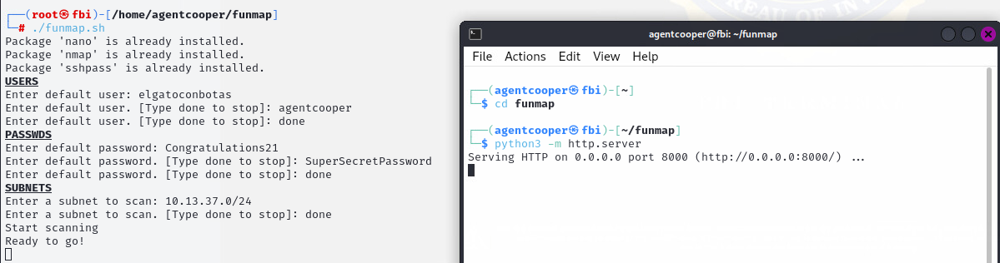
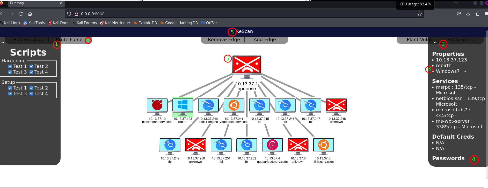

# funmap
F is for friends that blue team together

## Installation

Make sure you're in your home directory and run `git clone https://github.com/pyukey/funmap.git`

## Running

```
cd funmap
sudo ./funmap.sh
```
Using your given default credentials, enter the users, passwords, and subnets for the scan. When it says you're `Ready to go!`, start a webserver in the `funmap/` directory: `python3 -m http.server`


## Features
Funmap supports many features including: 
- a fully customizable network diagram (7)
- a password management service (3)
- a brute forcer to detect machines where default logins still work (6)
- a modular system to deploy or patch vulnerabilities across machines! (1)



1. Modular vulnerabilites located in `scripts` that you can deploy across any machines. The `patch` feature is used for blue-teaming, while the `plant` feature is used for red-teaming.

2. An info bar displaying properties of the selected machine

3. Hostname and distro are fully customizable, in case the initial scan fails

4. Funmap functions as a password manager, the default credentials that worked for the initial scan are displayed. Additionally, you will be able to search up the name of any user on that machine and retrieve their password!

5. Can scan again at any time by clicking **Rescan**. You can select specific nodes on the graph to scan. If none are selected, by default all machines will be scanned.

6. Similarly, there are a variety of buttons with different capabilites. You can roll passwords, brute force default credentials or deploy vulns|patches. Results will be output to the terminal you initially started funmap in.

7. Select machines by clicking them. Their info will be displayed in the info-box, and clikcing the buttons will run scripts on those machines. The graph can be zoomed, dragged around, and you can even add or remove edges using the buttons at the top.


# ToDo

- Actually implement the password management. Should also look into encrypting so the files aren't stored in plaintext. For now, you can just roll passwords whenever default login works
- Add LOTS of modules for vulnerabilities and tool setup
- Windows support (connect via WinRM, SMB)
- Create a version of funmap that runs on Windows
